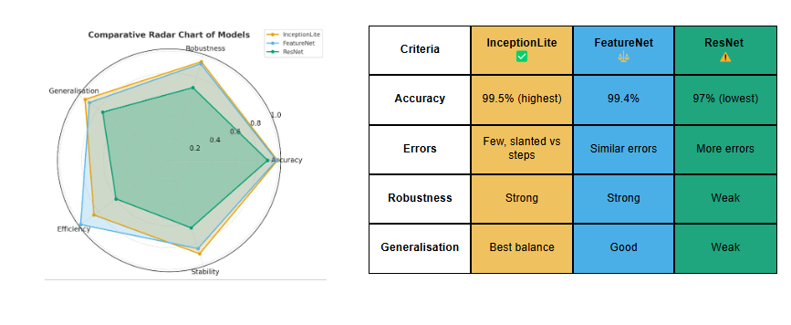

# 🧠 Scan2CAM-AI


> **AI-Supported Automatic Recognition of Component Scan Data for CAM Programming**

**Scan2CAM-AI** is an intelligent Deep Learning pipeline designed to bridge the gap between 3D scanning and Computer-Aided Manufacturing (CAM). It automates the recognition of machining features (e.g., holes, slots, pockets) from raw, noisy 3D scan data (STL) using Voxel-based CNNs.

Developed as part of the **Erasmus Mundus Joint Master in Manufacturing 4.0**.

---

## 🎥 Demo: Intelligent Recognition Dashboard

The interactive dashboard allows users to upload raw STL files, visualize the voxelization process in real-time, and receive instant feature classification.
[](https://www.youtube.com/watch?v=w-CZeLHiaiA)


*(The interface allows for drag-and-drop STL upload and instant prediction)*

---

## 🚀 Key Features

* **⚡ Automated Voxelization:** Converts continuous STL meshes into $128^3$ binary voxel grids to preserve geometric details for AI processing.
* **🧠 Multi-Architecture Support:** Implements and benchmarks **FeatureNet**, **3D ResNet**, and **InceptionLite** models.
* **🛡️ Synthetic-to-Real Transfer:** Uses **Transfer Learning** to adapt models trained on synthetic CAD data to real-world noisy 3D prints (Accuracy: ~38% → **~99%**).
* **📊 Industrial Viability:** The final model balances high accuracy with computational efficiency, making it suitable for deployment.

---

## 🏗️ Architecture & Pipeline

The system follows an end-to-end pipeline: **Raw STL Input → Voxelization → 3D CNN Classification → CAM Feature Prediction**.


*Figure 1: The end-to-end data processing and training pipeline.*

### Voxelization Engine
To enable 3D CNN processing, the system discretizes mesh surfaces into a volumetric occupancy grid.


*Figure 2: Visualization of a "Round" feature converted into a 128x128x128 voxel grid.*

---

## 📈 Model Performance

We evaluated three architectures on **Accuracy**, **Robustness** (noise tolerance), and **Efficiency**.

### 1. Comparative Analysis
**InceptionLite** (our proposed model) demonstrated superior robustness compared to standard FeatureNet and ResNet architectures.


*Figure 3: Radar chart comparing model performance metrics.*

### 2. Classification Accuracy
The final fine-tuned model achieved **99.28% accuracy**, effectively distinguishing between 24 distinct machining features.


*Figure 4: Confusion matrix showing high precision across all feature classes.*

---

## 🛠️ Installation & Usage

### 1. Clone the Repository
```bash
git clone [https://github.com/your-username/Scan2CAM-AI.git](https://github.com/your-username/Scan2CAM-AI.git)
cd Scan2CAM-AI
